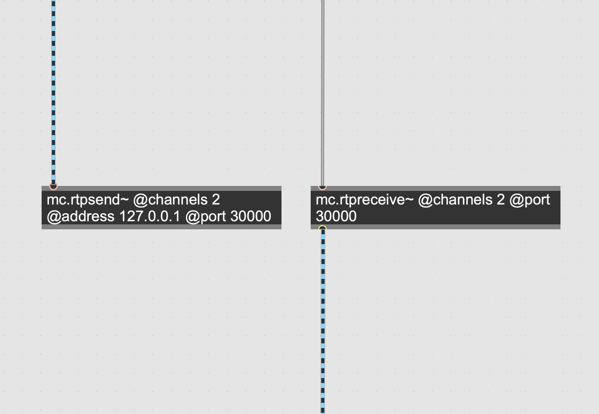

# mc.rtpsend~ / mc.rtpreceive~ 

[](https://travis-ci.org/tomoyanonymous/rtpsendreceive)

An modern alternative to netsend~ & netreceive~ objects using rtp protocol.



## notes

Currently number of channels are fixed by an attribute "channels", an auto-adaptation depending on input channels is not available due to a limitation of min-api.

A codec is also fixed to Linear PCM 16bit(Big Endian).


## Prerequisites

You can use the objects provided in this package as-is.


To code your own objects, or to re-compile existing objects, you will need a compiler:

* On the Mac this means **Xcode 9 or later** (you can get from the App Store for free). 
* On Windows this means **Visual Studio 2017** (you can download a free version from Microsoft). The installer for Visual Studio 2017 offers an option to install Git, which you should choose to do.

You will also need the Min-DevKit, available from the Package Manager inside of Max or [directly from Github](https://github.com/Cycling74/min-devkit).

### ffmpeg

This object uses ffmpeg(libav) as its backend. To link it statically, you need to prepare static-library version of ffmpeg. Most of 3rd-party libraries are disabled in configuration.

```bash

git clone https://git.ffmpeg.org/ffmpeg.git ffmpeg && cd ffmpeg

./configure --prefix={enter installation path}  --disable-avfoundation --disable-iconv --disable-filters --disable-devices --disable-shared --enable-static  --disable-optimizations  --disable-mmx --disable-audiotoolbox --disable-videotoolbox --disable-stripping   --disable-appkit --disable-zlib --disable-coreimage  --disable-bzlib --disable-securetransport --disable-sdl2 --disable-encoder=opus --disable-decoder=opus  --pkg-config-flags=--static --cc=clang --cxx=clang++ 

make -j

make install

```

## License

[LGPL v3.0](./License.md)

## Author

Tomoya Matsuura

https://matsuuratomoya.com

## Acknowledgements

The objects are originally made for works cooparated with [stu.inc](http://stu.inc/).


